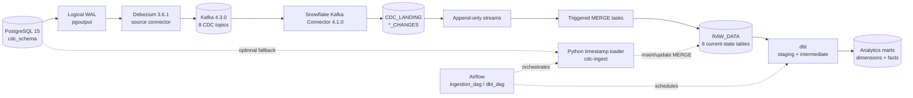

# PostgreSQL to Snowflake CDC Analytics

An end-to-end change data capture (CDC) project that moves inserts, updates, and
deletes from PostgreSQL to Snowflake through Debezium and Kafka, then builds
analytics-ready models with dbt. Docker Compose provides the local PostgreSQL,
Kafka, and Kafka Connect services; Snowflake hosts the landing, raw, and analytics
layers.

The repository also contains a simpler timestamp-based PostgreSQL-to-Snowflake
loader. It is useful as an MVP or fallback, but it does **not** capture deletes.

## What this project demonstrates

- PostgreSQL logical replication with `wal_level=logical` and `pgoutput`.
- Debezium CDC for eight related operational tables.
- Kafka topics as the durable transport between source and sink connectors.
- Snowflake account bootstrap with role separation and key-pair service-user auth.
- Snowflake landing tables, append-only streams, and triggered `MERGE` tasks.
- Idempotent raw-table upserts and hard-delete propagation.
- dbt staging, intermediate, dimensional, and fact models.
- Airflow DAGs for ingestion and dbt orchestration.
- A repeatable 1,000-row end-to-end CDC load test with JSON reporting.

## Architecture



### Primary CDC data flow

1. An application commits a change in `cdc_schema` in PostgreSQL.
2. PostgreSQL writes the change to its logical WAL.
3. Debezium reads the replication slot and publishes a `c`, `u`, or `d` event to
   the corresponding `cdc.cdc_schema.<table>` Kafka topic.
4. The Snowflake sink unwraps the Debezium envelope and appends the row plus
   `__OP`, `__LSN`, `__SOURCE_TS_MS`, and `__DELETED` metadata to
   `CDC_LANDING.<TABLE>_CHANGES`.
5. An append-only Snowflake stream exposes unconsumed landing events.
6. A triggered Snowflake task keeps the newest event per primary key, ordered by
   LSN and source timestamp, and merges it into `CDC_DATABASE.RAW_DATA`.
7. Inserts create raw rows, updates replace current values, and delete events
   remove raw rows.
8. dbt turns the raw tables into staging views, an inventory-balance intermediate
   model, four dimensions, and three fact tables.

### Captured tables

| PostgreSQL table | Primary key | Kafka topic | Snowflake landing table |
|---|---|---|---|
| `customer` | `customer_id` | `cdc.cdc_schema.customer` | `CUSTOMER_CHANGES` |
| `supplier` | `supplier_id` | `cdc.cdc_schema.supplier` | `SUPPLIER_CHANGES` |
| `product` | `product_id` | `cdc.cdc_schema.product` | `PRODUCT_CHANGES` |
| `sales_invoice` | `invoice_id` | `cdc.cdc_schema.sales_invoice` | `SALES_INVOICE_CHANGES` |
| `sales_invoice_item` | `item_id` | `cdc.cdc_schema.sales_invoice_item` | `SALES_INVOICE_ITEM_CHANGES` |
| `purchase_bill` | `bill_id` | `cdc.cdc_schema.purchase_bill` | `PURCHASE_BILL_CHANGES` |
| `purchase_bill_item` | `item_id` | `cdc.cdc_schema.purchase_bill_item` | `PURCHASE_BILL_ITEM_CHANGES` |
| `inventory_movement` | `movement_id` | `cdc.cdc_schema.inventory_movement` | `INVENTORY_MOVEMENT_CHANGES` |

## One-command local setup

### Prerequisites

- Docker with Docker Compose.
- Python 3.11 or newer and [uv](https://docs.astral.sh/uv/).
- A Snowflake account for the end-to-end path.
- Optional: Astro CLI to run the Airflow project locally.

From a fresh clone, one command starts PostgreSQL, Kafka, and Kafka Connect and
creates the Python environment:

```powershell
# PowerShell
docker compose up --build -d; if ($LASTEXITCODE -eq 0) { uv sync --project airflow_astro/dags/ingestion_logic }
```

```bash
# Bash
docker compose up --build -d && uv sync --project airflow_astro/dags/ingestion_logic
```

The images are versioned, and the downloaded Snowflake connector archive is
verified by SHA-256 during the Connect image build. Check the local services with:

```bash
docker compose ps
curl http://localhost:8083/connector-plugins
```

This command reproduces the **local** stack. Snowflake objects, credentials, and
connector registration are intentionally separate because they mutate an external
account and require a private key.

### Configure environment variables

```powershell
Copy-Item .env.example .env
```

```bash
cp .env.example .env
```

Fill in the Snowflake values. When connecting to the Compose PostgreSQL instance
from the host, also set these values (the container publishes port `5433`):

```ini
PG_HOST=localhost
PG_PORT=5433
PG_DATABASE=cdc_project
PG_USER=saif
PG_PASSWORD=saif
PG_SCHEMA=cdc_schema
```


## Complete the Snowflake CDC setup

The Snowflake SQL now records the account and database objects used by this
project. It provisions the following structure:

```text
CDC_WAREHOUSE (X-Small, auto-suspend after 60 seconds)
CDC_DATABASE
|-- CDC_LANDING   # 8 change tables, 8 streams, 8 merge tasks
|-- RAW_DATA      # current-state targets; table DDL is not yet in this repo
|-- STAGING_DATA  # reserved project schema
|-- DATA_MART     # reserved project schema
`-- ANALYTICS     # reserved project schema

CDC_ROLE                  # application/dbt role and schema owner
KAFKA_CONNECTOR_ROLE_1    # least-privilege connector/task role
KAFKA_USER                # key-pair-authenticated service user
```

`STAGING_DATA`, `DATA_MART`, and `ANALYTICS` are provisioned account objects, but
the current dbt project's final schema names still depend on its target schema and
dbt's custom-schema naming behavior.

### Before running the SQL

- Use a Snowflake user permitted to assume `ACCOUNTADMIN`, or adapt the bootstrap
  grants to your organization's administration roles.
- Replace both `RSA_PUBLIC_KEY` values in `01_snowflake_setup.sql` with your own
  service user's public key. Never place the matching private key in SQL or Git.
- Replace `SAIF` in `GRANT ROLE CDC_ROLE TO USER SAIF` if your application/dbt
  Snowflake user has a different name. The selected user must already exist.
- Create the eight current-state tables under `CDC_DATABASE.RAW_DATA` before the
  second script runs. Their columns must match the source registry and task
  `MERGE` statements.

Execute these files in order:

1. [`snowflake/01_snowflake_setup.sql`](snowflake/01_snowflake_setup.sql) creates
   `CDC_WAREHOUSE`, `CDC_DATABASE`, both roles, all five schemas, `KAFKA_USER`,
   least-privilege grants, and the eight schema-evolution-enabled landing tables.
2. Create or verify the eight `RAW_DATA` target tables. The future-table grant in
   step 1 gives `KAFKA_CONNECTOR_ROLE_1` the required DML privileges when they are
   created under `RAW_DATA`.
3. [`snowflake/02_cdc_streams_and_merge_tasks.sql`](snowflake/02_cdc_streams_and_merge_tasks.sql)
   creates the eight append-only streams and triggered merge tasks, resumes every
   task, and displays the resulting streams and tasks for verification.

The first script uses `ACCOUNTADMIN` for account-level creation and grants, then
switches to `CDC_ROLE` for schema ownership and `KAFKA_CONNECTOR_ROLE_1` for landing
objects. The second script runs entirely as `KAFKA_CONNECTOR_ROLE_1`.

### Register the connectors

Create the untracked sink configuration and replace every placeholder with your
Snowflake URL, user, private key, database, schema, and role:

```powershell
Copy-Item cdc_infrastructure/snowflake-sink-example.json cdc_infrastructure/snowflake-sink.json
```

```bash
cp cdc_infrastructure/snowflake-sink-example.json cdc_infrastructure/snowflake-sink.json
```

The setup script's matching sink values are `KAFKA_USER`,
`KAFKA_CONNECTOR_ROLE_1`, `CDC_DATABASE`, and `CDC_LANDING`. The connector config
must contain the private key paired with the public key installed by the SQL.

After Kafka Connect is healthy, register the source and sink:

```bash
curl -sS -X PUT http://localhost:8083/connectors/debezium-postgres/config \
  -H "Content-Type: application/json" \
  --data-binary @cdc_infrastructure/connector_config.json

curl -sS -X POST http://localhost:8083/connectors \
  -H "Content-Type: application/json" \
  --data-binary @cdc_infrastructure/snowflake-sink.json
```

PowerShell users should invoke `curl.exe` in those commands. Verify that both the
connector and task report `RUNNING`:

```bash
curl -sS http://localhost:8083/connectors/debezium-postgres/status
curl -sS http://localhost:8083/connectors/snowflake-cdc-sink/status
```

The source connector uses `snapshot.mode=initial`: its first successful start emits
the existing contents of all eight source tables before it continues from the WAL.

## Example: insert, update, and delete flowing to Snowflake

The following walkthrough uses customer ID `990001`. Run one source mutation at a
time and poll the Snowflake verification query until it converges before continuing.
Triggered tasks are asynchronous, so an immediate query can still show the previous
state.

### 1. Insert

```bash
docker exec cdc_postgres psql -U postgres -d cdc_project -c "INSERT INTO cdc_schema.customer (customer_id, first_name, last_name, email, phone_number) VALUES (990001, 'CDC', 'Demo', 'cdc.demo.990001@example.test', '+33990000001');"
```

```sql
SELECT CUSTOMER_ID, FIRST_NAME, LAST_NAME, EMAIL
FROM CDC_DATABASE.RAW_DATA.CUSTOMER
WHERE CUSTOMER_ID = 990001;
-- Expected: one row with FIRST_NAME = 'CDC'
```

### 2. Update

```bash
docker exec cdc_postgres psql -U postgres -d cdc_project -c "UPDATE cdc_schema.customer SET first_name = 'Updated' WHERE customer_id = 990001;"
```

```sql
SELECT CUSTOMER_ID, FIRST_NAME, UPDATED_AT
FROM CDC_DATABASE.RAW_DATA.CUSTOMER
WHERE CUSTOMER_ID = 990001;
-- Expected: one row with FIRST_NAME = 'Updated'
```

### 3. Delete

```bash
docker exec cdc_postgres psql -U postgres -d cdc_project -c "DELETE FROM cdc_schema.customer WHERE customer_id = 990001;"
```

```sql
SELECT COUNT(*) AS ROWS_REMAINING
FROM CDC_DATABASE.RAW_DATA.CUSTOMER
WHERE CUSTOMER_ID = 990001;
-- Expected: 0

SELECT __OP, __LSN, __SOURCE_TS_MS, __DELETED
FROM CDC_DATABASE.CDC_LANDING.CUSTOMER_CHANGES
WHERE CUSTOMER_ID = 990001
ORDER BY __LSN;
-- Expected operation history: c, u, d
```

If raw data does not converge, inspect both connector status endpoints first, then
run `SHOW TASKS IN SCHEMA CDC_DATABASE.CDC_LANDING` in Snowflake.

## Running the pipeline

### End-to-end CDC load test

With both connectors and all merge tasks running:

```bash
uv run --project airflow_astro/dags/ingestion_logic cdc-load-test
```

The test reserves customer IDs `900001` through `901000`, clears stale test data,
inserts 1,000 rows in one transaction, updates 100 rows, deletes a different 50
rows, monitors connector health, and waits for exact Snowflake convergence. It exits
non-zero on a failed assertion or timeout and writes a JSON report under `reports/`.

### Timestamp-based fallback loader

To bypass Debezium and Kafka and merge PostgreSQL rows directly into Snowflake:

```bash
uv run --project airflow_astro/dags/ingestion_logic cdc-ingest
uv run --project airflow_astro/dags/ingestion_logic cdc-ingest --table customer --table sales_invoice
```

The fallback requires the `updated_at` columns and triggers from
`postgres/init/03_add_updated_at.sql`. They are installed automatically only when
PostgreSQL initializes a new Docker volume. Apply the migration manually to an
existing volume:

```powershell
Get-Content -Raw postgres/init/03_add_updated_at.sql | docker exec -i cdc_postgres psql -U postgres -d cdc_project
```

```bash
docker exec -i cdc_postgres psql -U postgres -d cdc_project < postgres/init/03_add_updated_at.sql
```

For each table, this loader:

- acquires a PostgreSQL session advisory lock;
- captures a fixed `(previous cutoff - overlap, PostgreSQL clock_timestamp()]`
  extraction window;
- streams rows into a bounded Snowflake temporary stage;
- deduplicates by primary key and accepts only newer `updated_at` values;
- commits the raw merge and checkpoint atomically.

The default five-minute overlap makes retries idempotent and catches ordinary late
commits. A transaction open longer than the overlap can still be missed, and deletes
are never detected. Do not run the timestamp loader and the Debezium merge path as
competing production writers without defining ownership and reconciliation rules.

Inspect fallback-loader metrics with:

```sql
SELECT *
FROM CDC_DATABASE.RAW_DATA.INGESTION_CHECKPOINTS
ORDER BY SOURCE_TABLE;
```

### dbt and Airflow

Local dbt execution requires a `cdc_analytics` profile in `~/.dbt/profiles.yml`:

```bash
uv run --project airflow_astro/dags/ingestion_logic dbt build --project-dir .
```

The Airflow project contains:

- `ingestion_dag`: runs the timestamp loader daily and triggers `dbt_dag` after a
  successful load;
- `dbt_dag`: uses Astronomer Cosmos and a `snowflake_conn` Airflow connection, and
  is also scheduled every 15 minutes.

Start it with `astro dev start` from `airflow_astro/` after configuring the Airflow
Snowflake connection and required environment variables.

## Test and performance results

### Credential-free unit tests

Canonical command:

```bash
uv run --project airflow_astro/dags/ingestion_logic python -m unittest discover -s tests -v
```

Latest local result on **2026-08-30**:

| Result | Count | Runner time |
|---|---:|---:|
| Passed | 21 | 0.038 s total |
| Errors | 2 | included above |
| Total | 23 | 0.038 s |

The two errors are test-harness import/patch issues: the tests import
`airflow_astro.dags.ingestion_logic.ingestion.pipeline` but patch
`ingestion.pipeline`, creating two module identities. They affect the window and
advisory-lock mock tests; they are errors, not passing results, and should be fixed
before treating the unit suite as a green CI gate.

### Observed end-to-end CDC performance

The saved laptop run `20260829T122420Z-41d137d0` completed on **2026-08-29** with
status `PASSED`:

| Measurement | Observed result |
|---|---:|
| PostgreSQL inserts | 1,000 |
| Inserts visible in Snowflake | 1,000 |
| Insert convergence time | 14.159 s |
| Observed end-to-end insert throughput | 70.63 records/s |
| PostgreSQL updates | 100 |
| PostgreSQL deletes | 50 |
| Mixed update/delete convergence time | 29.991 s |
| Landing CDC events (`c` / `u` / `d`) | 1,000 / 100 / 50 |
| Final Snowflake rows | 950 |
| Missing surviving rows | 0 |
| Duplicate primary keys | 0 |
| Deleted rows remaining | 0 |
| Connector failures | 0 |

This is an observed functional load test, not a capacity benchmark. Hardware,
network distance, Snowflake warehouse size, and concurrent workload were not
recorded, so the throughput number should not be generalized. Run the load test in
your environment and retain its generated JSON report for comparison.

## Design trade-offs

| Decision | Benefit | Cost / limitation |
|---|---|---|
| Debezium logical CDC | Captures inserts, updates, and deletes from committed WAL changes | Requires replication-slot monitoring and Kafka Connect operations |
| Kafka between source and sink | Decouples PostgreSQL from Snowflake and absorbs bursts | Adds infrastructure and at-least-once delivery concerns |
| Append-only landing tables | Preserves an auditable event history and supports replay/debugging | Landing storage grows and needs retention management |
| LSN-ordered Snowflake merge | Deduplicates repeated delivery and applies the newest event per key | Assumes source LSN metadata is present and comparable |
| Triggered Snowflake tasks | Avoids fixed polling schedules and reduces idle work | Convergence is asynchronous and depends on warehouse/task health |
| Landing schema evolution | New source fields can arrive without immediately breaking the sink | Raw tables and dbt models still need deliberate migrations |
| Timestamp fallback with overlap | Simple, bounded, retry-safe insert/update loading | Cannot capture deletes and can miss transactions longer than the overlap |
| Hard deletes in raw tables | Raw data reflects PostgreSQL current state | Historical deletion analysis depends on retaining the landing event log |

## Repository layout

```text
.
|-- docker-compose.yaml                  # PostgreSQL, Kafka, Kafka Connect
|-- postgres/init/                       # schema, seed data, updated_at triggers
|-- cdc_infrastructure/                  # connector image and configurations
|-- snowflake/                           # Snowflake bootstrap, streams, merge tasks
|-- airflow_astro/dags/                  # Airflow orchestration
|-- airflow_astro/dags/ingestion_logic/  # Python loader and CDC load test
|-- cdc_analytics/                       # dbt models, tests, and macros
`-- tests/                               # credential-free Python unit tests
```

## Known gaps before production

- The Snowflake setup provisions the warehouse, database, roles, schemas, service
  user, and landing layer, but it does not create the eight `RAW_DATA` tables.
- `01_snowflake_setup.sql` contains a fixed application-user name and RSA public
  key. Parameterize them or manage these identities through infrastructure as code
  before sharing the deployment across environments.
- `uv.lock` is currently ignored, so Python dependencies use declared lower bounds
  rather than a committed immutable lock. Commit the project lockfile for
  byte-for-byte dependency reproducibility.
- Local PostgreSQL and Kafka use development credentials and plaintext listeners.
- Connector secrets need an external secret manager and key rotation policy.
- Kafka, Connect, and PostgreSQL are single-node services without high availability.
- Replication-slot lag, Kafka lag, Snowflake task failures, and landing-table growth
  need production monitoring and alerting.
- The unit-test import/patch mismatch described above prevents a fully green suite.

To stop the local services while retaining their named volumes:

```bash
docker compose down
```
